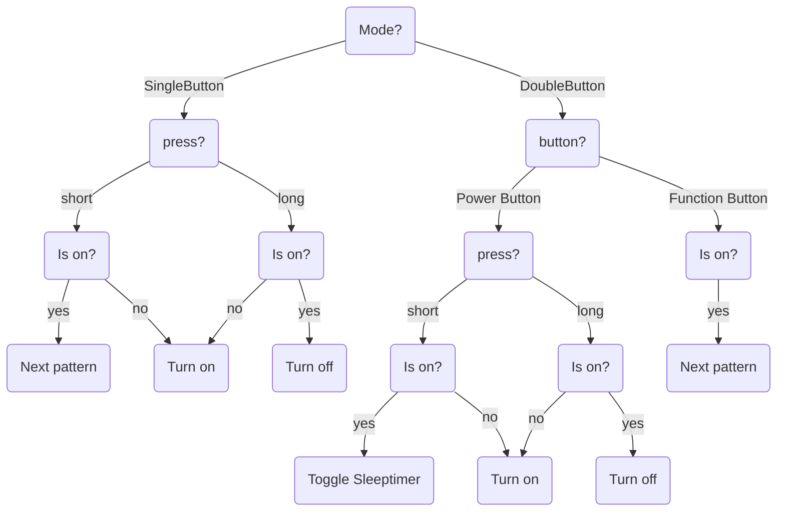

# Weihnachten

## Compilation

This project includes a Makefile which will call [arduino-cli](https://arduino.github.io/arduino-cli/1.1/). \
Make targets are:
- all
- compile
- upload
- monitor
- configure
- select\_port
- select\_flags

Make Options are:
- PORT\*
- FLAGS\*
- BAUDRATE (only used for monitor target)

(\*) Will use environment variable of the same name if set

### Examples:
```bash
# Compile, upload, monitor, default port (/dev/ttyUSB0)
make

# Select a connected board and flags interactively using fzf
eval $(make configure)
# OR
eval `make configure`

# Compile and upload to port /dev/tty.usbserial110 (macos)
make PORT=/dev/tty.usbserial110 compile upload

# Compile, upload, monitor, SingleButton-Mode, no pullup buttons, default port (/dev/ttyUSB0)
make FLAGS="-DSINGLE_BUTTON -DUSE_PULLUP=0"
```

---
<details>
<summary>Settings without code changes (using build flags):</summary>

To set these, run
```bash
make FLAGS="-D<FLAG1>[=<VALUE1>] -D<FLAG2>[=<VALUE2>]"
```

Available flags are:

- Use single button mode instead of double button mode (SINGLE\_BUTTON; default: unset)
- Use pullup buttons (USE\_PULLUP; default: 1)

</details>


<details>
<summary>Settings with code changes:</summary>
To set these, go to the Settings section in Weihnachten.ino

- pins for buttons and rgbleds
- rgbleds (not tested with more or less than 3 rgbleds)
     - *RGBLEDs* array with *RGBLed*: ( pin\_r, pin\_g, pin\_b, val\_r, val\_g, val\_b )
     - values are semi-optional as they are automatically set by the patterns on start
- default pattern on startup
    - *currentPattern* is index of *patterns* array
- sleeptimer wait time

</details>

**analog pins require software pulse width modulation which might flicker for small values**

---

## Usage:



For example:
- A short press in SingleButton-Mode while the device is on will switch to the next pattern.
- A long press in DoubleButton-Mode on the PowerButton while the device is on will turn it off.

---

Can connect to serial monitor with baud 115200 to debug and send commands.

Available commands are:
- p\<num>   // change to pattern number <num> (e.g. p0 changes to first pattern)

###### \n and \r will be ignored
